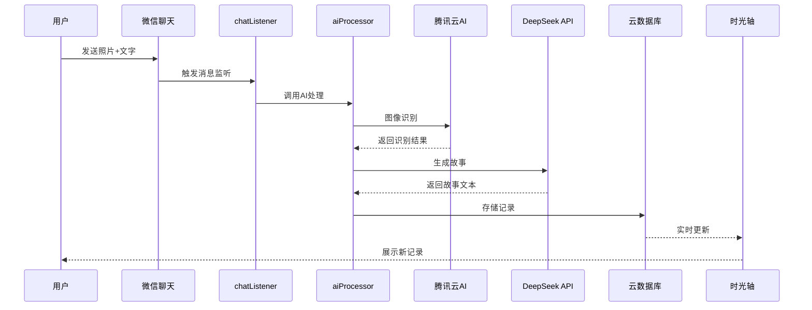

# 宝宝成长记录 - 微信小程序

🍀 AI驱动的宝宝成长记录小程序，通过微信聊天发送照片自动生成温馨的成长故事。

## ✨ 功能特色

- 📱 **微信小程序**：精美的时光轴界面展示
- 🤖 **AI智能处理**：自动生成温暖的成长故事  
- 🏷️ **智能标签**：自动分类"宝宝的第一次"、"成长曲线"等
- 💬 **微信聊天集成**：发送照片+描述即可记录
- 🎨 **温馨设计**：专为亲子场景设计的粉色主题

## 🏗️ 技术架构

```
微信聊天 → 微信公众号 → Vercel服务器 → 小程序云数据库 → 时光轴展示
```

- **前端**：微信小程序原生框架
- **后端**：Express.js + Vercel托管  
- **数据库**：微信云开发数据库
- **AI服务**：腾讯云图像识别 + DeepSeek文本生成

## 📂 项目结构

```
├── pages/              # 小程序页面
│   ├── timeline/      # 时光轴主页面
│   ├── chat/          # 聊天记录页面  
│   ├── detail/        # 详情页面
│   └── settings/      # 设置页面
├── server/            # Vercel服务器代码
│   ├── index.js       # Express服务器
│   └── package.json   # 依赖配置
├── cloudfunctions/    # 云函数
│   ├── aiProcessor/   # AI处理函数
│   └── wechatServer/  # 微信消息处理
└── vercel.json        # Vercel部署配置

```

## 🚀 部署指南

### 1. Vercel部署（微信服务器）
- 连接GitHub仓库到Vercel
- 自动获得HTTPS域名
- 配置微信公众号服务器URL

### 2. 微信小程序部署  
- 配置云开发环境
- 部署云函数
- 发布小程序版本

## 📱 使用方法

1. **关注公众号**：`宝宝成长记录助手`
2. **发送照片**：直接发送宝宝照片
3. **添加描述**：发送文字描述补充信息
4. **查看结果**：在小程序中查看AI生成的故事
5. **时光轴浏览**：按时间线查看所有成长记录

## 🎯 核心亮点

- **零学习成本**：通过熟悉的微信聊天记录
- **AI赋能**：智能图像识别和故事生成
- **温情设计**：专为记录宝宝成长设计
- **实时同步**：聊天记录实时同步到小程序

---

💝 用AI的力量，记录宝宝成长的每个珍贵瞬间

## 🎯 项目概述

### 核心功能
- **智能聊天记录**：通过微信聊天发送照片+文字，自动生成成长故事
- **AI图像识别**：使用腾讯云AI识别图片内容（物体、场景、情感）
- **故事自动生成**：集成DeepSeek API生成温暖优雅的成长叙事
- **智能分类系统**：自动提取标签，按类别组织成长记录
- **时光轴展示**：美观的时间轴界面展示宝宝成长历程

### 技术特色
- **云原生架构**：微信云开发 + 云函数 + 云数据库 + 云存储
- **AI集成**：腾讯云图像识别 + DeepSeek文本生成
- **实时处理**：消息监听 → AI处理 → 数据存储 → 界面更新
- **智能标签**：自动识别"第一次"、"成长曲线"、"运动发展"等类别

## 🏗 技术架构

### 技术栈
- **前端**：微信小程序原生框架
- **后端**：微信云开发（Node.js云函数）
- **数据库**：微信云数据库（MongoDB）
- **存储**：微信云存储
- **AI服务**：腾讯云图像识别API + DeepSeek API

### 核心云函数
```
cloudfunctions/
├── chatListener/     # 消息监听云函数
│   ├── index.js     # 捕获微信聊天消息
│   └── package.json
└── aiProcessor/     # AI处理云函数
    ├── index.js     # 图像识别+故事生成+数据存储
    └── package.json
```

### 数据库设计
```javascript
// growth_records 集合
{
  _id: "record_id",           // 记录ID
  imageUrl: "cloud://...",    // 云存储图片URL
  originalText: "宝宝第一次走路", // 用户原始描述
  story: "午后阳光洒满客厅...", // AI生成的故事
  tags: ["宝宝的第一次"],      // 智能分类标签
  imageAnalysis: {            // 图像识别结果
    objects: ["婴儿", "客厅"],
    scenes: ["温馨", "家庭"],
    emotions: ["快乐"]
  },
  openid: "user_openid",      // 用户标识
  createTime: Date,           // 创建时间
  timestamp: Date             // 原始时间戳
}
```

## 🔧 核心功能实现

### 1. 消息监听流程
```javascript
// chatListener 云函数
exports.main = async (event) => {
  const { imageUrl, userText, openid } = event
  
  // 调用AI处理云函数
  const result = await cloud.callFunction({
    name: 'aiProcessor',
    data: { imageUrl, userText, openid }
  })
  
  return result
}
```

### 2. AI处理流程
```javascript
// aiProcessor 云函数核心流程
async function processGrowthRecord(imageUrl, userText) {
  // 1. 图像识别
  const imageAnalysis = await analyzeImage(imageUrl)
  
  // 2. 故事生成
  const story = await generateStory(imageAnalysis, userText)
  
  // 3. 智能标签
  const tags = generateTags(userText)
  
  // 4. 存储数据
  const record = await saveToDatabase({
    imageUrl, originalText: userText,
    story, tags, imageAnalysis
  })
  
  return record
}
```

### 3. 智能标签系统
```javascript
function generateTags(userText) {
  const tags = []
  
  if (userText.includes('第一次')) tags.push('宝宝的第一次')
  if (userText.includes('身高') || userText.includes('体重')) tags.push('成长曲线')
  if (userText.includes('爬') || userText.includes('走')) tags.push('运动发展')
  if (userText.includes('说话')) tags.push('语言发展')
  // ... 更多智能分类规则
  
  return tags
}
```

## 📱 页面功能

### 时光轴页面 (timeline)
- **筛选标签**：全部、宝宝的第一次、成长曲线等
- **时间轴展示**：垂直时间轴布局，展示成长记录
- **手动添加**：支持手动上传照片+描述生成记录
- **下拉刷新**：实时同步最新记录

### 聊天记录页面 (chat)
- **消息历史**：展示通过聊天生成的记录
- **实时同步**：显示AI处理状态和结果

### 详情页面 (detail)
- **完整故事**：查看AI生成的完整故事
- **原始描述**：对比用户原始输入
- **图像分析**：展示AI识别的图片内容

### 设置页面 (settings)
- **宝宝信息**：设置宝宝年龄等基础信息
- **AI配置**：调整故事生成风格
- **数据管理**：导出、备份成长记录

## 🚀 快速开始

### 1. 环境准备
```bash
# 1. 下载微信开发者工具
https://developers.weixin.qq.com/miniprogram/dev/devtools/download.html

# 2. 申请微信小程序账号
https://mp.weixin.qq.com/

# 3. 开通微信云开发
在微信开发者工具中开通云开发环境
```

### 2. 项目配置
```bash
# 1. 克隆项目
git clone <repository-url>

# 2. 导入微信开发者工具
选择项目根目录导入

# 3. 配置云环境ID
在 timeline.js 中修改 env: 'your-env-id'

# 4. 部署云函数
右键 cloudfunctions 文件夹 → 部署
```

### 3. API密钥配置
```javascript
// 在云函数环境变量中配置
DEEPSEEK_API_KEY=your_deepseek_api_key
TENCENT_CLOUD_SECRET_ID=your_secret_id
TENCENT_CLOUD_SECRET_KEY=your_secret_key
```

## 🎨 设计规范

### 色彩方案
- **主色调**：#FF6B9D（粉红色）- 温馨亲子感
- **渐变色**：#FF6B9D → #FF8FA3（渐变效果）
- **背景色**：#FFF5F8（淡粉背景）
- **卡片色**：#FFFFFF（纯白卡片）

### UI特色
- **时光轴设计**：垂直时间轴，突出时间流逝感
- **卡片布局**：圆角卡片，柔和阴影
- **渐变效果**：粉色渐变，营造温暖氛围
- **流畅动画**：滑入、淡入等过渡动画

## 🔌 API集成

### DeepSeek API集成
```javascript
// 故事生成API调用
const response = await axios.post('https://api.deepseek.com/v1/chat/completions', {
  model: 'deepseek-chat',
  messages: [{
    role: 'user',
    content: `图片内容：${objects}；用户描述：${userText}；生成80字温暖故事`
  }],
  max_tokens: 200
}, {
  headers: {
    'Authorization': `Bearer ${process.env.DEEPSEEK_API_KEY}`,
    'Content-Type': 'application/json'
  }
})
```

### 腾讯云AI集成
```javascript
// 图像识别API调用
const client = new tencentcloud.tiia.v20190529.Client({
  credential: {
    secretId: process.env.TENCENT_CLOUD_SECRET_ID,
    secretKey: process.env.TENCENT_CLOUD_SECRET_KEY
  },
  region: "ap-beijing"
})

const response = await client.DetectLabel({
  ImageUrl: imageUrl
})
```

## 📊 数据流程图



## 🔄 开发计划

### P0 功能（已完成）
- [x] 基础项目架构
- [x] 云函数框架
- [x] 时光轴界面
- [x] 数据库设计
- [x] AI集成方案

### P1 功能（开发中）
- [ ] DeepSeek API集成
- [ ] 腾讯云AI集成
- [ ] 聊天记录页面
- [ ] 设置页面
- [ ] 数据导出功能

### P2 功能（规划中）
- [ ] 多宝宝支持
- [ ] 成长统计图表
- [ ] 家人协作功能
- [ ] 智能相册生成

## 📄 许可证

MIT License

## 🤝 贡献指南

1. Fork 项目
2. 创建功能分支 (`git checkout -b feature/AmazingFeature`)
3. 提交更改 (`git commit -m 'Add some AmazingFeature'`)
4. 推送到分支 (`git push origin feature/AmazingFeature`)
5. 创建 Pull Request

## 📞 联系方式

- 项目地址：[GitHub Repository]
- 问题反馈：[Issues]
- 邮箱联系：your-email@example.com

---

**宝宝成长记录** - 让AI为每个美好瞬间写下温暖的故事 👶✨ 